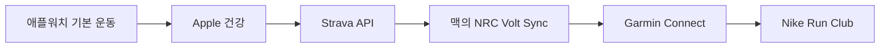

# NRC Volt Sync

**애플워치 러닝을 Strava와 Garmin Connect를 거쳐 Nike Run Club(NRC)에 전달하는 무료 macOS 로컬 동기화 도구입니다.**

[English](README.md) · [설치 준비 체크리스트](docs/SETUP.ko.md) · [개인정보 안내](PRIVACY.md) · [문제 해결](docs/TROUBLESHOOTING.md)

애플 기본 운동 앱으로 기록한 러닝이 Strava에는 들어가지만 NRC에는 나타나지 않는 문제를 해결하기 위해 만들었습니다. 자신의 Strava 기록을 읽어 검증된 Garmin FIT 파일을 만들고 Garmin Connect에 올린 뒤, Nike가 공식 지원하는 Garmin 파트너 연결을 통해 NRC로 전달합니다.

> 개인 데이터 이동을 위한 알파 소프트웨어입니다. Nike, Strava, Garmin, Apple이 보증하거나 제휴한 제품이 아닙니다. Garmin 업로드는 커뮤니티의 비공식 클라이언트를 사용하므로 Garmin의 변경에 따라 작동이 중단될 수 있습니다.

## 왜 만들었나요?

Nike Run Club에는 외부 활동을 넣는 공개 API가 없습니다. 반면 Apple 건강은 애플 기본 운동 기록을 Strava에 자동 업로드할 수 있고, NRC는 Garmin을 공식 파트너로 지원합니다. 이 프로젝트는 유료 동기화 서비스 없이 그 사이를 연결하며, 없는 운동 데이터를 임의로 만들지 않습니다.



## 주요 기능

- Strava에서 애플워치 러닝·트레일러닝·가상 러닝만 골라냅니다.
- 원본에 있는 GPS, 심박, 고도, 파워, 케이던스, 거리, 시간을 FIT에 보존합니다.
- 세부 스트림이 없으면 실제 총거리와 시간만 담고 GPS·심박·케이던스를 만들지 않습니다.
- Garmin 원본 기록은 건너뛰어 순환 업로드를 막습니다.
- 로컬 SQLite와 Garmin의 날짜·거리·시간을 함께 검사해 중복을 방지합니다.
- 시험 실행, 기간별 과거 기록 복구, 15분 또는 원하는 주기의 자동 실행을 지원합니다.
- 계정 정보와 운동 파일은 저장소 밖에 소유자 전용 권한으로 보관합니다.
- `status` 출력의 모든 계정값을 자동으로 가립니다.

## 설치 전에 준비할 것

1. Python 3.12와 [`uv`](https://docs.astral.sh/uv/getting-started/installation/)가 설치된 Mac
2. 애플 기본 운동 앱으로 러닝을 기록하는 Apple Watch와 iPhone
3. Apple 건강의 **자동 업로드**를 켠 무료 Strava 계정
4. 콜백 도메인을 `localhost`로 만든 본인 소유의 무료 [Strava API 앱](https://www.strava.com/settings/api)
5. 무료 Garmin Connect 계정
6. NRC의 **설정 → 파트너**에서 연결한 Garmin 계정

이 프로젝트 자체에는 유료 구독이 없습니다. 각 외부 서비스의 계정 정책과 제공 여부는 해당 회사가 관리합니다.

정확한 권한 스위치와 콜백 입력값은 명령을 실행하기 전에 [docs/SETUP.ko.md](docs/SETUP.ko.md)에서 확인하세요.

## 빠른 설치

```bash
git clone https://github.com/nirvanasangsara-AI/nrc-volt-sync.git
cd nrc-volt-sync
uv sync
uv run nrc-volt-sync configure-strava
uv run nrc-volt-sync configure-garmin
uv run nrc-volt-sync doctor
```

최근 러닝 한 건을 실제 업로드 없이 검증합니다.

```bash
uv run nrc-volt-sync sync --after-days 14 --limit 1 --dry-run
```

기간을 정해 누락 러닝을 복구합니다.

```bash
uv run nrc-volt-sync sync --after 2025-01-01 --before 2025-12-31 --limit 100
```

15분 자동 동기화를 설치합니다.

```bash
uv run nrc-volt-sync install-service
```

일주일에 한 번만 실행하려면 다음과 같이 설정합니다. 지연된 Apple 건강 가져오기를 위해 30일을 다시 확인합니다.

```bash
uv run nrc-volt-sync install-service --interval-minutes 10080 --lookback-days 30
```

상태를 보거나 자동 서비스만 제거할 수 있습니다.

```bash
uv run nrc-volt-sync status
uv run nrc-volt-sync uninstall-service
```

## 과거 기록 복구 원칙

먼저 한 건만 올려 Garmin Connect와 NRC에서 지도·거리·시간·심박을 확인하세요. 그다음 한 달이나 1년 단위로 나눠 복구하면 서비스의 호출 제한을 피하기 쉽습니다. 같은 명령을 다시 실행해도 로컬 상태 DB와 Garmin 대조가 중복을 막습니다.

NRC가 FIT 데이터를 자체 계산하므로 NRC에 표시되는 거리는 Strava나 Garmin과 조금 다를 수 있습니다.

## 로컬에 저장되는 정보

Git 저장소에는 계정 비밀값이나 개인 운동 기록을 넣지 않습니다. 실행 중 만들어지는 정보는 다음 위치에 저장됩니다.

```text
~/Library/Application Support/NRCVoltSync/
```

이 폴더에는 Strava OAuth 토큰, Garmin 세션 토큰, 활동 식별자, GPS·건강 데이터가 포함된 FIT 파일, 로그, 중복 방지 DB가 들어갈 수 있습니다. 모두 소유자 전용 권한으로 생성되지만 이 폴더나 FIT, 화면 캡처, 가리지 않은 로그는 공개하지 마세요.

## 제한사항

- 백그라운드 자동 서비스는 macOS를 지원합니다.
- 걷기·자전거·근력운동은 NRC 대상이 아니므로 올리지 않습니다.
- 케이던스는 Strava가 제공할 때만 보존하며 없는 값은 추정하지 않습니다.
- Nike 공개 가져오기 API가 없어 Garmin 파트너 연결 상태에 의존합니다.
- Garmin 인증과 업로드는 비공식 `garminconnect` 패키지를 사용하므로 속도 제한이나 서비스 변경의 영향을 받을 수 있습니다.

## 자주 묻는 질문

### 애플워치 기록을 NRC로 직접 보낼 수 있나요?

Nike가 외부 기록용 공개 API를 제공하지 않아 직접 전송은 지원되지 않습니다. 이 도구는 자신의 Strava 데이터를 FIT로 바꿔 Garmin 파트너 경로를 사용합니다.

### 무료인가요?

네. MIT 라이선스이며 프로젝트 자체의 유료 기능은 없습니다.

### 모든 운동이 올라가나요?

아닙니다. 러닝만 처리하고 걷기·자전거·근력운동 등은 건너뜁니다.

### 케이던스가 왜 없나요?

Strava가 모든 Apple 건강 러닝의 케이던스를 공개하지 않습니다. 원본 스트림이 있으면 보존하고 없으면 빈 상태로 둡니다.

## 개발과 기여

```bash
uv sync --dev
uv run pytest -q
uv run ruff check .
```

공개 이슈에 실제 FIT 파일, 토큰, 이메일, 활동 ID, GPS 경로를 첨부하지 마세요. 자세한 내용은 [CONTRIBUTING.md](CONTRIBUTING.md)를 확인하세요.

## 라이선스와 상표

MIT License. Nike Run Club, NRC, Apple Watch, Strava, Garmin, Garmin Connect는 각 소유자의 상표이며 상호운용성 설명 목적으로만 사용했습니다.
