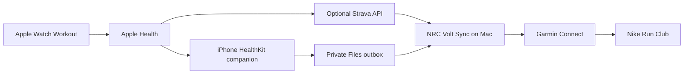

# NRC Volt Sync

**Free, local Apple Watch / Apple Health → Garmin Connect → Nike Run Club (NRC) run sync, with or without Strava.** Also discoverable for the common search phrase **Nike Running Club**; the official product name is Nike Run Club.

[한국어 문서](README.ko.md) · [Setup checklist](docs/SETUP.md) · [Direct Apple Health companion](docs/HEALTHKIT_COMPANION.md) · [Without Strava](docs/WITHOUT_STRAVA.md) · [Privacy](PRIVACY.md) · [Troubleshooting](docs/TROUBLESHOOTING.md)

NRC Volt Sync helps when a run recorded with Apple's native Watch Workout app does not appear in Nike Run Club. People searching for Apple Watch to **Nike Running Club** sync are looking for the same NRC workflow. The tool reads the runner's own Apple Health outbox or Strava activities, creates validated Garmin FIT files, uploads them to Garmin Connect, and lets the Garmin–Nike partner connection deliver those runs to NRC.

> Beta software for personal data portability. It is not affiliated with or endorsed by Nike, Strava, Garmin, or Apple. Garmin upload access uses an unofficial community client and may break when Garmin changes its private API.

## Why this exists

Nike Run Club does not provide a public activity-import API. NRC supports Garmin as a connected partner, so this project converts the runner's own Apple Health or Strava source into validated FIT and uses that partner path. The direct HealthKit source is an open-source iPhone companion; no paid sync service or maintainer server is required.



## Features

- Reads Apple-origin running workouts directly from HealthKit through the included iPhone companion, without Strava.
- Also supports Apple Watch runs, trail runs, and virtual runs found in Strava.
- Writes optional portable FIT copies for user-directed import into other services.
- Preserves available GPS, heart rate, altitude, power, cadence, distance, and timing streams.
- Creates summary-only FIT records when Strava has only real total distance and time; it never fabricates GPS, heart rate, or cadence.
- Skips Garmin-origin activities to prevent circular imports.
- Checks date, distance, duration, and a local SQLite state database to prevent duplicates.
- Supports dry runs and historical date-range backfills.
- Installs an optional macOS LaunchAgent for unattended sync every 15 minutes or any interval you choose.
- Stores credentials and workout files outside the repository with owner-only permissions.
- Redacts every stored account field from `status` output.
- Reports partial batch failures with a non-zero exit code so background errors are visible and retryable.

## Before you install

Prepare these first:

1. A Mac with Python 3.12 and [`uv`](https://docs.astral.sh/uv/getting-started/installation/).
2. An Apple Watch and iPhone using Apple's native Workout app for runs.
3. Choose one input: the included iPhone HealthKit companion, or a free Strava account with Apple Health **Automatic Uploads** enabled.
4. For the direct source: full Xcode and a free Apple ID for personal device signing. For Strava: your own free [Strava API application](https://www.strava.com/settings/api).
5. A free Garmin Connect account, connected inside NRC under **Settings → Partners**.

No paid subscription is required by this project. Service availability and account requirements are controlled by the providers.

Do not use Strava? Version 0.3 includes the direct source. Follow [Direct Apple Health companion](docs/HEALTHKIT_COMPANION.md). Apple's free Personal Team profile expires after 7 days and requires weekly reinstall; that Apple distribution limit is documented before setup.

For the exact permission switches, callback values, and a printable checklist, read [docs/SETUP.md](docs/SETUP.md) before running any command.

## Quick start

```bash
git clone https://github.com/nirvanasangsara-AI/nrc-volt-sync.git
cd nrc-volt-sync
uv sync
```

Choose either the direct HealthKit outbox:

```bash
uv run nrc-volt-sync configure-healthkit --outbox "/path/to/private/outbox"
```

or connect your own Strava API app:

```bash
uv run nrc-volt-sync configure-strava
```

Connect Garmin. The password is read once by the Garmin client and is not written to the project configuration:

```bash
uv run nrc-volt-sync configure-garmin
```

Run the privacy-safe prerequisite check:

```bash
uv run nrc-volt-sync doctor
```

Validate one recent run without uploading it:

```bash
uv run nrc-volt-sync sync --after-days 14 --limit 1 --dry-run
```

Upload missing Apple Watch runs from a date range:

```bash
uv run nrc-volt-sync sync --after 2025-01-01 --before 2025-12-31 --limit 100
```

Start automatic sync every 15 minutes:

```bash
uv run nrc-volt-sync install-service
```

Weekly sync is also supported. A 30-day lookback leaves room for delayed Apple Health imports:

```bash
uv run nrc-volt-sync install-service --interval-minutes 10080 --lookback-days 30
```

Check status or remove only the automatic service:

```bash
uv run nrc-volt-sync status
uv run nrc-volt-sync uninstall-service
```

## Historical backfill safety

Start with one activity and inspect it in both Garmin Connect and NRC. Then backfill one month or one year at a time to stay within provider rate limits. The state database makes reruns idempotent, and Garmin is queried again before every upload.

NRC may recalculate distance from the imported FIT data, so its displayed total can differ slightly from Strava or Garmin.

## What is stored locally

The repository contains no account credentials or workout history. Runtime data is stored under:

```text
~/Library/Application Support/NRCVoltSync/
```

That folder can contain Strava OAuth tokens, Garmin session tokens, activity identifiers, FIT files with routes and health data, logs, and the duplicate-prevention database. Files are created with owner-only permissions. Do not publish that folder, FIT files, screenshots, or unredacted logs. See [PRIVACY.md](PRIVACY.md).

Version 0.2 automatically removes legacy raw Garmin response payloads from the duplicate-prevention database while preserving upload status and identifiers.

## Limitations

- macOS is the supported unattended-service platform.
- Only workouts identified as runs are sent to NRC; cycling, walking, and strength workouts are intentionally ignored.
- Apple Workout → Strava automatic import currently applies only to native Apple Workout activities within Strava's supported import window.
- HealthKit background delivery timing is controlled by iOS; opening the companion and exporting recent runs is the reliable fallback.
- Cadence is preserved only when a source exposes it. The direct HealthKit schema deliberately omits unavailable cadence; missing cadence is never estimated.
- Nike exposes no public import API, so delivery depends on the Garmin partner connection.
- Garmin authentication and upload rely on the community `garminconnect` package and can be rate-limited or changed without notice.

## FAQ

### Can I sync Apple Watch runs directly to Nike Run Club?

Not through a public Nike import API. This project uses the supported Garmin partner path after converting the runner's own Apple Health or Strava data to FIT.

### What if I do not use Strava?

Use the included iPhone HealthKit companion and a private Files/iCloud Drive outbox. It preserves the HealthKit fields that exist and the Mac processes them automatically. See [docs/HEALTHKIT_COMPANION.md](docs/HEALTHKIT_COMPANION.md).

### Is NRC Volt Sync free?

Yes. The code is MIT-licensed and has no paid component. The external providers control their own account policies.

### Does it upload every Apple Watch workout?

No. It uploads runs only. Other workout types are not meaningful in Nike Run Club and are skipped.

### Will it create duplicate runs?

It checks a local state database and compares date, distance, and elapsed time against Garmin before upload. No duplicate-prevention system is perfect, so validate one run first.

### Why is cadence missing?

Neither Strava nor the direct HealthKit queries expose cadence for every Apple Health activity. The converter preserves a cadence stream when a source has one and leaves it blank when absent.

## Development

```bash
uv sync --dev
uv run coverage run -m pytest -q
uv run coverage report
uv run ruff check .
swift test --package-path ios
```

Please read [CONTRIBUTING.md](CONTRIBUTING.md) and never attach real FIT files, tokens, email addresses, activity IDs, or GPS traces to public issues.

The direct-source interchange contract is published as
[`schema/healthkit-workout-v1.schema.json`](schema/healthkit-workout-v1.schema.json), with an
obviously synthetic example under `examples/`. This makes independent, privacy-preserving source
adapters possible without depending on the iOS UI.

## Acknowledgements, license, and trademarks

NRC Volt Sync uses Ron Klinkien and contributors' [`python-garminconnect`](https://github.com/cyberjunky/python-garminconnect), Garmin's [FIT SDK](https://developer.garmin.com/fit/download/), and [HTTPX](https://github.com/encode/httpx). See [THIRD_PARTY_NOTICES.md](THIRD_PARTY_NOTICES.md) for their separate licenses.

NRC Volt Sync's own code is MIT-licensed. Nike Run Club, NRC, Apple Watch, Strava, Garmin, and Garmin Connect are trademarks of their respective owners. Their names are used only to describe interoperability.
