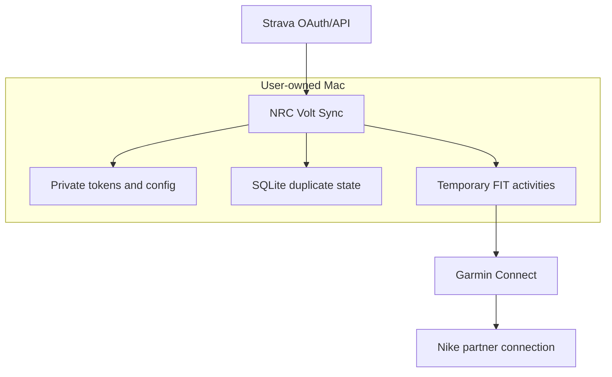

# Architecture and data fidelity

## Pipeline

1. `strava.py` performs local OAuth and reads the authenticated athlete's activities and high-resolution streams.
2. `sync.py` accepts running types, rejects Garmin-origin activities, and checks the local completion state.
3. `fit.py` encodes the available source fields with Garmin's official FIT SDK and decodes the result again to verify CRC, structure, distance, and elapsed time.
4. `garmin.py` checks a narrow date window for a matching run before upload and confirms the uploaded activity appeared.
5. `state.py` records the source fingerprint and outcome in a local SQLite database.
6. Nike Run Club receives the run through the user's existing Garmin partner connection; NRC Volt Sync never authenticates directly to Nike.

## Trust boundaries

No maintainer-operated server exists. The providers and the user's Mac are the only network and storage boundaries.

## Duplicate strategy

The local state uses the Strava activity ID as the primary key and stores a fingerprint based on start time, rounded distance, elapsed time, and activity type. Before upload, Garmin activities within one day of the source start are compared using:

- running activity type
- start time within 120 seconds
- distance within 1.5% or 100 metres
- duration within 3% or 180 seconds

This intentionally favours avoiding duplicate uploads. Users should validate the first activity before a historical backfill.

## FIT fidelity

Stream records can contain distance, speed, heart rate, running cadence, power, altitude, and latitude/longitude. Session and lap summaries contain real source totals. If Strava supplies no usable distance stream but provides real total distance and elapsed time, two endpoint records preserve those totals without adding a route or sensor readings.

Every generated FIT is decoded immediately. Upload is blocked if CRC, structure, distance, or elapsed-time validation fails.
