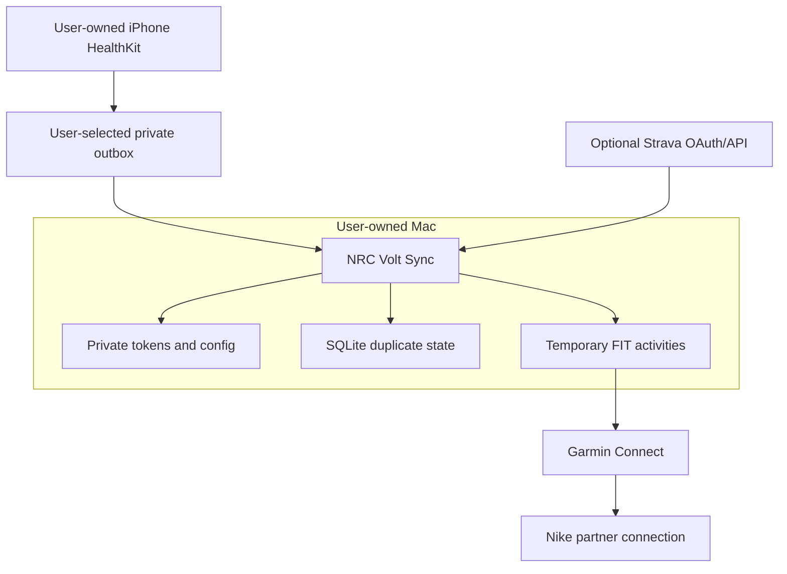

# Architecture and data fidelity

## Pipeline

1. The iPhone companion reads authorized Apple-origin runs from HealthKit and atomically writes the
   public JSON schema to a user-selected Files outbox. Alternatively, `strava.py` reads the user's
   OAuth-authorized activities and streams.
2. `healthkit.py` validates the schema, bounds, ordering, timestamps, and cumulative distance;
   `sync.py` applies the existing Strava source filters.
3. `fit.py` places each available source field on its real source timestamp. It decodes every result
   to verify CRC, structure, distance, and elapsed time before any upload.
4. `garmin.py` checks a narrow date window for a matching run before upload and confirms the uploaded activity appeared.
5. `state.py` records a composite source/source-ID key, source-neutral fingerprint, and outcome in a local SQLite database.
6. Nike Run Club receives the run through the user's existing Garmin partner connection; NRC Volt Sync never authenticates directly to Nike.

## Trust boundaries

No maintainer-operated server exists. The providers and the user's Mac are the only network and storage boundaries.

## Source boundary

Version 0.3 has two sources: direct HealthKit JSON from the included iPhone companion, and Strava.
Apple documents that macOS apps cannot read or write HealthKit data, so the Mac cannot independently
discover Apple Watch workouts. The user-authorized iPhone app and private outbox keep that boundary
explicit. See [HEALTHKIT_COMPANION.md](HEALTHKIT_COMPANION.md).

The intended source-neutral boundary is a validated activity model plus a portable FIT outbox.
Garmin/NRC is the first destination. Future automatic destinations must use their own supported APIs
and user authorization rather than sharing credentials or scraping private endpoints.

## Duplicate strategy

The local state uses `(source, source ID)` as its primary key and stores a fingerprint based on start
time, rounded distance, elapsed time, and activity type. Version 0.3 migrates existing Strava rows
without discarding completion state. Before upload, Garmin activities within one day of the source
start are compared using:

- running activity type
- start time within 120 seconds
- distance within 1.5% or 100 metres
- duration within 3% or 180 seconds

This intentionally favours avoiding duplicate uploads. Users should validate the first activity before a historical backfill.

## FIT fidelity

Stream records can contain distance, speed, heart rate, running cadence, power, altitude,
latitude/longitude, stride length, vertical oscillation, and ground-contact time. HealthKit route and
sensor samples retain their own timestamps without interpolation. Session and lap summaries contain
real source totals. When only summary values exist, two endpoint records preserve those totals
without adding a route or sensor readings.

Every generated FIT is decoded immediately. Upload is blocked if CRC, structure, distance, or elapsed-time validation fails.
